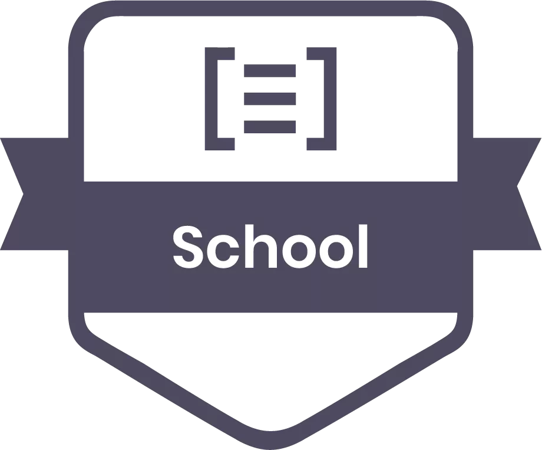

# SFEIR School Conversational developer

 

 

[Discover the SFEIR Schools](https://www.sfeir.com/fr/contenus-dexperts/sfeir-school)

[Register to Sfeir Chatbot session](https://www.sfeir.com/fr/sfeir-school-chatbot-2/)

# Slides

You can view the slides [here](https://docs.google.com/presentation/d/1XvF2jaF0t36Dxg9_KWxu2BVtjxdH0clLmkMqrVxrgtY/edit?usp=sharing).   
The reveal open format is a [work in progress](https://sfeir-open-source.github.io/sfeir-school-conversational-developer/).

## Workshop

Workshops are in directory `steps`. You should first cd into it and run `npm install`.
In `package.json` you will found some script to help you work.   
You will find two directories per workshop :
  * a basic directory with boilerplate for the exercice, README with exercice todo and tips 
  * a second directory suffixed with `-solution` which contains source file with solutions and explanation in README.

To launch your code, use script `npm run watch -- --source=<step dir>`

## Develop

To run docs locally, go in directory `docs` and run `npx serve` of if you don't have node, you can use docker `docker-compose up`, and open slides on http://localhost:5000/.

## Contributing

### Contributing Guidelines

Read through our [contributing guidelines][contributing] to learn about our submission process, coding rules and more.

### Want to Help?

Want to file a bug, contribute some code, or improve documentation? Excellent! Read up on our guidelines for [contributing][contributing] and then check out one of our issues labeled as <kbd>help wanted</kbd> or <kbd>good first issue</kbd>.

### Code of Conduct

Help us be open and inclusive. Please read and follow our [Code of Conduct][codeofconduct].

[contributing]: CONTRIBUTING.md
[codeofconduct]: https://github.com/sfeir-open-source/code-of-conduct/blob/master/CODE_OF_CONDUCT.md
